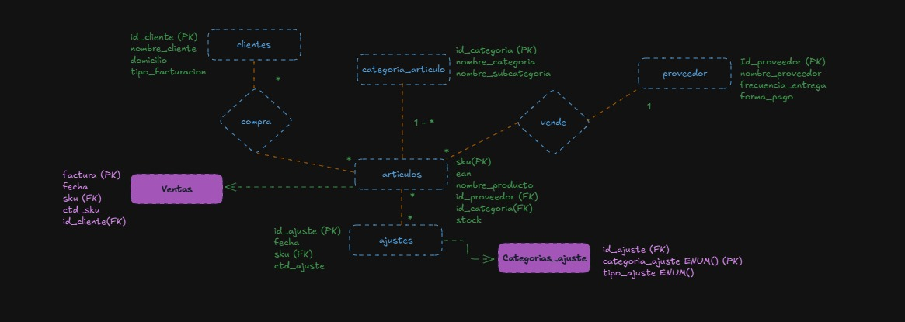
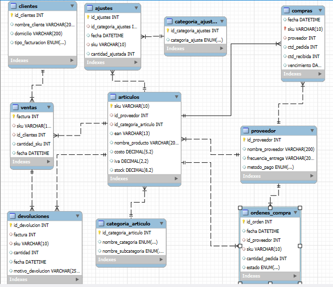

# TRABAJO FINAL SQL

- Alumno: Dario Ponce
- Comision: 59430
- Tutor: Nicolás Maugeri
- Docente: Anderson Torres

## Tematica del Proyecto
Abordar las necesidades de gestión de cualquier comercio, en especial para este trabajo se utilizo un ejemplo de supermercado.
Las problemáticas que resuelve son las siguientes:

1. Gestión de Sucursales
2. Relación con Proveedores
3. Gestión de Artículos y Categorías
4. Seguimiento de Ventas
5. Control de Compras
6. Manejo de Devoluciones
7. Ajustes de Inventario
8. Administración de Clientes

Los beneficios de esta base de datos son:

 - Centralización de datos: Toda la información relevante está unificada.
 - Trazabilidad: Cada transacción (compra, venta, devolución, ajuste) está documentada, permitiendo auditar y analizar operaciones.
 - Automatización: Las relaciones entre tablas mediante claves primarias y foráneas simplifican la ejecución de consultas y reportes.
 - Escalabilidad: El modelo soporta la adición de más sucursales, productos, o clientes sin necesidad de rediseñar la estructura.
 

## Diseño Orignal de Base de datos DER ONTOLOGICO

## DER WORKBENCH

# Esquema de la Base de Datos

### Tabla sucursales:
Almacena la información de las sucursales del supermercado.

Campos:
- id_sucursal (INT)(PK): Identificador único de la sucursal.
- nombre_sucursal	(VARCHAR): Nombre de la sucursal.
- direccion (VARCHAR): Dirección física de la sucursal.
- telefono (VARCHAR): Número de contacto de la sucursal.
- ciudad (VARCHAR): Ciudad donde se encuentra la sucursal.
- provincia (VARCHAR): Provincia donde se encuentra la sucursal.
- codigo_postal (VARCHAR): Código postal de la sucursal.
- fecha_apertura (DATE): Fecha en que la sucursal comenzó a operar.

Relaciones:
    - Tabla ventas: campo id_sucursal
    - Tabla compras: campo id_sucursal
    - Tabla ajustes: campo id_sucursal
    - Tabla ordenes_compra: campo id_sucursal
    - Tabla devoluciones: campo id_sucursal

### Tabla proveedor:
Registra información sobre los proveedores que suministran productos.

Campos:
- id_proveedor (INT)(PK): Identificador único del proveedor.
- nombre_proveedor (VARCHAR): Nombre del proveedor.
- frecuencia_entrega (VARCHAR): Frecuencia de entrega de productos.
- metodo_pago	(ENUM): Método de pago acordado.

Relaciones:
    - Tabla articulos: campo id_proveedor
    - Tabla compras: campo proveedor
    - Tabla ordenes_compra: campo id_proveedor

### Tabla categoria_articulo:
Define las categorías y subcategorías de los artículos.

Campos:
- id_categoria_articulo (INT)(PK): Identificador único de la categoría.
- nombre_categoria (ENUM): Categoría general.
- nombre_subcategoria	(ENUM):	Subcategoría.

Relaciones:
    - Tabla articulos: campo id_categoria_articulos

### Tabla articulos:
Registra información de los productos disponibles en el supermercado.

Campos:
- sku	(VARCHAR)(PK): Código único del producto, se utiliza como PK ya que el mismo proceso de creacion no permite duplicaciones.
- id_proveedor (INT): Proveedor del artículo.
- id_categoria_articulo (INT): Categoría del artículo.
- ean	(VARCHAR): Código de barras internacional del artículo.
- nombre_producto	(VARCHAR): Nombre descriptivo del producto.
- costo (DECIMAL): Costo unitario del producto.
- iva	(DECIMAL): Porcentaje de IVA aplicado al producto.

Relaciones:
    - Tabla proveedor: campo id_proveedor
    - Tabla categoria_articulo: campo id_categoria_articulo
    - Tabla ventas: campo sku
    - Tabla ajustes: campo sku
    - Tabla compras: campo sku
    - Tabla devoluciones: campo sku
    - Tabla ordenes_compra: campo sku
  
### Tabla clientes:
Contiene información sobre los clientes del comercio

Campos:
- id_clientes	(INT)(PK): Identificador único del cliente.
- nombre_cliente (VARCHAR): Nombre completo del cliente.
- domicilio (VARCHAR): Dirección del cliente.
- tipo_facturacion (ENUM): Tipo de facturación.

Relaciones
    Tabla ventas: campo id_clientes

### Tabla categoria_ajustes:
Define los motivos para realizar ajustes de inventario.

Campos:
- id_categoria_ajustes (INT)(PK): Identificador único del motivo de ajuste.
- categoria_ajuste (ENUM): Motivo del ajuste.

Relaciones:
    Tabla ajustes: campo id_categoria_ajustes

### Tabla ajustes:
Registra los ajustes realizados al inventario.

Campos:
- id_sucursal (INT): Sucursal que realiza el ajuste.
- id_ajustes (INT)(PK): Identificador único del ajuste.
- id_categoria_ajustes (INT): Motivo del ajuste.
- fecha (DATETIME): Fecha y hora del ajuste.
- sku	(VARCHAR): Artículo ajustado.
- cantidad_ajustada (INT): Cantidad ajustada (positiva o negativa).

Relaciones:
    - Tabla sucursales: campo id_sucursal
    - Tabla articulos: campo sku
    - Tabla categoria_ajustes: campo id_categoria_ajuste

### Tabla ventas:
Registra información sobre las ventas realizadas.

Campos:
- factura	(INT)(PK): Número de factura de la venta.
- id_sucursal	(INT): Sucursal donde se realiza la venta.
- sku	(VARCHAR): Producto vendido.
- id_clientes	(INT): Cliente que realizó la compra.
- cantidad_sku (INT): Cantidad del producto vendido.
- fecha (DATETIME): Fecha y hora de la venta.

Relaciones:
    - Tabla sucursales: campo id_sucursal.
    - Tabla articulos: campo sku.
    - Tabla clientes: campo id_clientes.
    - Tabla devoluciones: campo factura.

### Tabla compras:
Registra las compras realizadas a los proveedores.

Campos:
- id_sucursal	(INT): Sucursal que realiza la compra.
- fecha (DATETIME): Fecha en que se realizó la compra.
- sku	(VARCHAR)(PK): Artículo comprado.
- proveedor (INT): Proveedor del producto.
- ctd_pedida (INT): Cantidad pedida en la compra.
- ctd_recibida (INT): Cantidad recibida del pedido.
- vencimiento	(DATE):	Fecha de vencimiento del producto (si aplica).

Relaciones:
    - Tabla sucursales:campo id_sucursal.
    - Tabla articulos: campo sku.
    - Tabla proveedor: campo proveedor.

### Tabla devoluciones:
Registra las devoluciones realizadas.

Campos:
- id_devolucion(INT)(PK):	Identificador único de la devolución.
- factura(INT): Venta asociada a la devolución.
- id_sucursal(INT): Sucursal donde se realizó la devolución.
- sku	(VARCHAR): Producto devuelto.
- cantidad(INT): Cantidad de producto devuelto.
- fecha (DATETIME): Fecha de la devolución.
- motivo_devolucion (VARCHAR): Razón específica de la devolución.

Relaciones:
    - Tabla ventas: campo factura.
    - Tabla sucursales: campo id_sucursal.
    - Tabla articulos: campo sku.

### Tabla ordenes_compra:
Registra las órdenes de compra enviadas a los proveedores.

Campos:
- id_orden (INT)(PK): Identificador único de la orden de compra.
- fecha (DATETIME): Fecha de creación de la orden.
- id_sucursal (INT): Sucursal para la que se genera la orden.
- id_proveedor (INT): Proveedor al que se dirige la orden.
- sku	(VARCHAR):Producto solicitado.
- cantidad_pedida (INT): Cantidad pedida del producto.
- estado (ENUM): Estado de la orden.

Relaciones:
    - Tabla sucursales:campo id_sucursal.
    - Tabla proveedor: campo id_proveedor.
    - Tabla articulos: campo sku.

## USUARIOS

Se crean 2 usuarios para el area comercial y para el area de operaciones y se asignan lo permisos correspondientes

## OBJETOS
### VISTAS

Cada vista está diseñada para proporcionar información clave sobre las ventas, inventarios y proveedores en el contexto de un comercio.

- vw_top_5_articulos_mas_vendidos: Muestra los 5 productos más vendidos, ordenados por la cantidad total vendida. Incluye el SKU, el nombre del producto y la cantidad total vendida.

- vw_articulos: Proporciona información relevante de los productos, incluyendo SKU, nombre, costo, proveedor, categoría, subcategoría, y stock (calculado como la diferencia entre lo comprado, lo vendido y los ajustes).

- vw_vencimientos: Muestra los productos con vencimiento próximo (en los próximos 5 días). Incluye el SKU, nombre del producto, fecha de vencimiento y los días restantes para que venza.

- vw_sin_movimiento: Muestra los productos que no han tenido ventas en los últimos 30 días, incluyendo el SKU, nombre del producto y proveedor. Si no se ha registrado venta, se muestra como sin movimiento.

- vw_ventas_por_sucursal: Detalla las ventas por sucursal, incluyendo nombre de la sucursal, ciudad, provincia, mes de la venta, cantidad de ventas, unidades vendidas, costo total, venta con IVA, categoría, subcategoría, y cantidad de clientes únicos por sucursal.

### Funciones

Estas funciones están diseñadas para facilitar el análisis de inventarios, ajustes y ventas en el contexto de tu base de datos de supermercado.

- fn_dias_stock: Calcula los días de stock disponibles para un producto, basado en las ventas promedio diarias de los últimos 30 días. Si no hay ventas durante este período, la función devuelve 999 días. Usa el stock actual del producto y la venta diaria promedio para determinar cuántos días puede mantenerse en inventario.

- categoria_mas_ajustes: Determina cuál es la categoría con más ajustes (modificaciones en inventario) en la base de datos. La función busca la categoría con el mayor número de ajustes registrados en la tabla ajustes y devuelve el nombre de la categoría correspondiente.

- fn_total_ventas_producto: Calcula el total de ventas de un producto en un período específico. Recibe como parámetros el SKU del producto y el rango de fechas, y devuelve el total de ventas para ese producto, calculado como la suma de las unidades vendidas multiplicadas por su costo con IVA.

### Procedimientos

Estos procedimientos están diseñados para facilitar la inserción de proveedores y la obtención de reportes detallados de ventas en el sistema de un comercio

agregar_proveedor: Permite agregar un nuevo proveedor al sistema. Recibe como parámetros el nombre del proveedor, la frecuencia de entrega y el método de pago. Inserta esta información en la tabla proveedor y devuelve el ID del nuevo proveedor agregado.

ventas_por_fecha: Genera un reporte de ventas para un rango de fechas específico. Recibe dos parámetros: la fecha de inicio y la fecha de fin. El reporte incluye la fecha de la venta, el nombre del producto, la cantidad vendida, el costo total de las ventas, el nombre del cliente y el tipo de facturación, ordenado por la fecha de venta.

### Triggers

Estos triggers están diseñados para gestionar el stock de productos de manera automática, evitar ventas sin inventario y proteger los artículos que ya han sido vendidos de ser eliminados.

- agregar_compras: Este trigger se activa después de insertar un nuevo registro en la tabla compras. Si el artículo ya existe en el inventario de una sucursal, actualiza el stock sumando la cantidad recibida. Si el artículo no existe, inserta un nuevo registro en la tabla stock_sucursal con el stock recibido.

- descontar_ventas: Este trigger se activa después de insertar un nuevo registro en la tabla ventas. Verifica si hay suficiente stock disponible para la venta. Si hay stock suficiente, lo resta del inventario. Si no hay suficiente stock, genera un error indicando que no es posible realizar la venta debido a la falta de inventario.

- no_borrar: Este trigger se activa antes de eliminar un artículo de la tabla articulos. Verifica si el artículo tiene ventas asociadas en la tabla ventas. Si tiene historial de ventas, impide la eliminación del artículo lanzando un error.

## Herramientas y Documentacion utilizada

### Herramientas tecnologicas
- MySQL Workbench
- Visual Studio Code
- GitHub Desktop
### Documentacion
- Manual de MySQL Workbench (https://dev.mysql.com/doc/workbench/en/)
- claude.ia
- ChatGPT.com
### Otros
- GitHub.com

## CONCLUSIONES

Esta base de datos trata de ser una herramienta integral para optimizar los procesos operativos, logísticos y administrativos de un un comercio.
Si bien el retail es un rubro en constante evolucion, he logrado generar una base de datos funcional que ayuda a resolver la mayoria de las problematicas que suelen encontrarse en la gestion de un comercio.
Los objetos generados son una muestra de las posibilidades de analisis que se pueden seguir agregando sin necesidad de altear la estructura del trabajo realizado.
Esta Base de Datos es apta para utilizarse con diferentes herramientas de generacion de tableros tales como Power BI, Tableau, etc. lo que permitiria realizar una analisis mas detallado de los diferentes puntos de gestión que se necesitan para gestionar de manera correcta el negocio.

